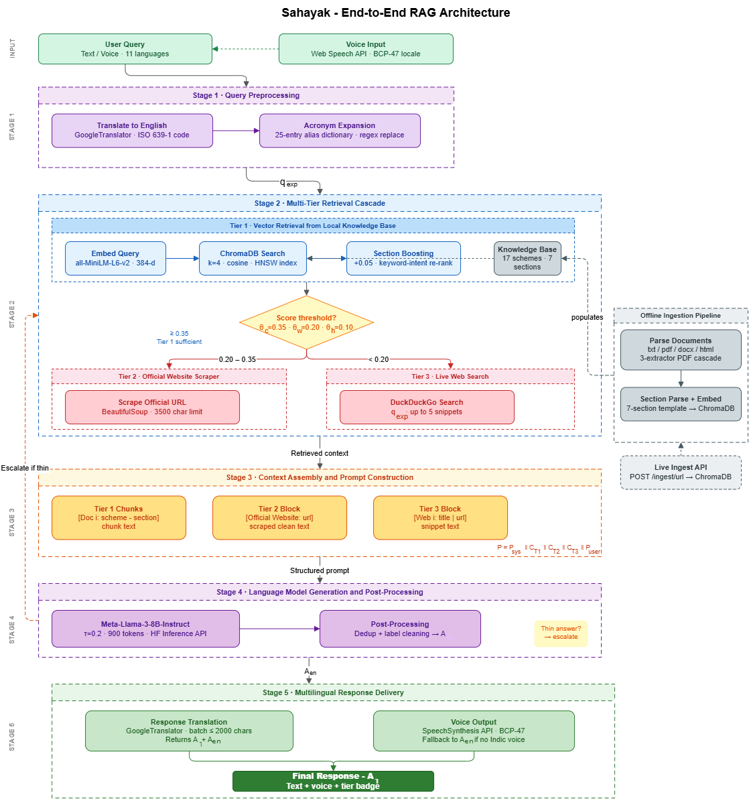

# Sahayak — India's Government Scheme Assistant

**Multilingual RAG chatbot for Indian government welfare schemes.**  
Ask about PM-KISAN, PMJDY, MUDRA, Ayushman Bharat and 16 other schemes in Hindi, Telugu, Tamil, Kannada, Bengali, and 6 more Indian languages. Speak your question aloud and hear the answer read back to you. Powered by Meta-Llama-3-8B-Instruct via Hugging Face and ChromaDB vector search.


---

## Architecture



The pipeline runs through five sequential stages: query preprocessing (translation + acronym expansion), multi-tier retrieval cascade (ChromaDB → official URL → DuckDuckGo), context assembly, LLM generation (Meta-Llama-3-8B-Instruct, τ=0.2), and multilingual response delivery with optional voice output.

---

## Preview

The interface features a dark navy sidebar listing all loaded schemes with domain icons and a stats panel (chunks indexed, active language), a saffron-and-tricolour palette inspired by the Indian flag, and a hero landing area with four quick-start suggestion cards. A microphone button in the input bar activates voice queries, and a Voice On/Off toggle in the header auto-plays every response aloud.

---

## Features

- **11 Indian languages** — English, Hindi, Telugu, Tamil, Kannada, Bengali, Marathi, Gujarati, Punjabi, Odia, Malayalam (native-script labels in the language dropdown)
- **Voice input** — click the microphone button and speak in any supported language; the live transcript appears in the input bar and is auto-submitted on a pause; a Stop button cancels mid-utterance
- **Voice output** — Voice On/Off toggle in the header auto-speaks every response; individual Speak buttons on each message allow on-demand replay
- **Smart TTS fallback** — if the device lacks a voice pack for the selected language, the system speaks the English version of the answer instead of producing garbled audio
- **3-tier retrieval cascade** — ChromaDB vector search → official scheme website → DuckDuckGo web search, escalating automatically; indexed documents always take priority over external sources
- **Multi-format ingestion** — `.txt`, `.pdf`, `.docx`, `.doc`, `.md`, `.html`, `.rtf`
- **URL crawling** — place a `urls.txt` file in `schemes/` (one URL per line) for depth-1 crawl ingestion at build time; or use `POST /ingest/url` to add URLs live without restarting the server
- **Accurate translation pipeline** — query translated to English for retrieval; answer generated in English then translated back; English version always preserved as TTS fallback
- **Section-aware chunking** — documents parsed into seven semantic sections (Overview, Benefits, Eligibility, Application Process, Documents Required, FAQs, Website URL) for precise retrieval
- **Section boosting** — 12 intent keywords trigger a secondary filtered query to prioritise the most relevant section (+0.05 score boost)
- **Source attribution** — every answer shows the source scheme, section, and cosine similarity score as percentage chips
- **Tier badges** — answers labelled "From Documents", "From Official Website", or "From Web Search"
- **Dark mode** — full dark theme toggle with preference saved in localStorage
- **Acronym expansion** — 25 scheme acronyms (PMJDY, PM-KISAN, JJM, MUDRA, APY, etc.) expanded before retrieval to prevent vocabulary mismatch
- **Live status badge** — header shows a green "Live" pill confirming backend connectivity
- **Stats panel** — sidebar footer shows total chunks indexed and active language
- **Standalone translation utility** — `translator.py` can be used independently of the main app

---

## Project Structure

```
sahayak/
├── app.py              # FastAPI server (v2.0.0) — /chat, /schemes, /health, /ingest/url
├── rag.py              # RAG pipeline — 3-tier cascade, LLM, translation, acronym expansion
├── ingest.py           # Document ingestion — multi-format parsing, URL crawling, ChromaDB embedding
├── translator.py       # Standalone translation utility
├── requirements.txt    # Python dependencies (pip install -r requirements.txt)
├── schema.txt          # 7-section template for adding new scheme .txt files
├── env.example         # Environment variable template (HF_TOKEN, LLM_MODEL)
├── Architecture_Diagram.png   # System architecture diagram
├── Sahayak Architecture xml code.xml   # System architecture diagram xml code - upload to draw.io
├── schemes/            # Scheme documents (.txt, .pdf, .docx) — 17 schemes, 233 chunks
│   ├── pm_jan_dhan_yojana.txt
│   ├── pm_kisan_samman_nidhi.txt
│   ├── Janani Suraksha Yojana.pdf
│   ├── pm_vanbandhu_kalyan_yojana.docx
│   └── ...             # 17 schemes total
├── static/
│   └── index.html      # Single-page frontend (chat UI, voice, dark mode, stats panel)
└── Outputs/            # Screenshots for documentation
    ├── home_screen.png
    ├── dark_mode.png
    ├── languages.png
    ├── voice_off.png
    ├── english_query.png
    ├── english_benefits.png
    ├── acronym_query.png
    ├── hindi_query.png
    ├── telugu_query.png
    ├── mixed_script.png
    ├── tier2_response.png
    ├── tier3_response.png
    ├── voice_input.png
    └── voice_output.png
```

---

## Setup and Installation

### Prerequisites

- Python 3.11 or higher
- A Hugging Face account with a read-access API token
- Model access approved for `meta-llama/Meta-Llama-3-8B-Instruct` on Hugging Face (or another supported model — see step 4)
- A modern browser (Chrome or Edge recommended for full voice input support)

### 1. Clone the repository

```bash
git clone https://github.com/amrutha0001/Sahayak_Indic_Muliti-lingual_Chatbot.git
cd sahayak
```

### 2. Create and activate a virtual environment

```bash
# macOS / Linux
python3.11 -m venv venv
source venv/bin/activate

# Windows
py -3.11 -m venv venv
venv\Scripts\activate
```

### 3. Install dependencies

```bash
pip install -r requirements.txt
```

### 4. Configure environment variables

```bash
# macOS / Linux
cp env.example .env

# Windows
copy env.example .env
```

Edit `.env` and fill in your values:

```env
HF_TOKEN=hf_your_actual_token_here

# Choose one model (default shown below):
LLM_MODEL=meta-llama/Meta-Llama-3-8B-Instruct

# Alternatively, uncomment one of these:
# LLM_MODEL=microsoft/Phi-3-mini-4k-instruct
# LLM_MODEL=google/gemma-2-2b-it
# LLM_MODEL=mistralai/Mistral-7B-Instruct-v0.3
```

### 5. Build the vector database

```bash
python ingest.py
```

This reads all files in `schemes/`, parses them into sections, generates embeddings with `all-MiniLM-L6-v2`, and writes the vector index to `chroma_db/`. Expect 233 chunks for the default 17-scheme knowledge base.

To also ingest URLs at build time, create `schemes/urls.txt` with one URL per line before running this command.

### 6. Start the server

```bash
uvicorn app:app --reload --port 8000
```

Open `http://127.0.0.1:8000` in your browser. The green "Live" badge in the header confirms the backend is ready.

---

## API Endpoints

| Method | Endpoint | Description |
|--------|----------|-------------|
| `GET` | `/` | Serves the single-page frontend |
| `GET` | `/health` | Returns server status and current chunk count |
| `GET` | `/schemes` | Returns a sorted list of all loaded scheme names |
| `POST` | `/chat` | Main chat endpoint — accepts `{question, language}`, returns answer, sources, and tier |
| `POST` | `/ingest/url` | Crawls a URL and adds it to the live ChromaDB collection without a server restart |

> **Note:** The `/ingest/file` endpoint has been removed in v2.0.0. To add new files, place them in `schemes/` and re-run `ingest.py`.

---

## Usage

1. Select your language from the dropdown in the header (11 languages with native-script labels)
2. Type your question, click a suggestion card, or press the microphone button and speak
3. Sahayak retrieves relevant scheme information and answers in your chosen language
4. Source chips below each answer show the scheme, section, and similarity score
5. The tier badge shows whether the answer came from local documents, the official website, or web search
6. Toggle "Voice On" in the header to have every response spoken automatically
7. Use the Speak button on any individual message to replay that answer at any time

### Example queries

```
How to apply for Skill India Mission?
What are the benefits of Startup India?
Who is eligible for PM-KISAN?
बेटी पढ़ाओ बेटी बचाओ के क्या फायदे हैं?
అటల్ పెన్షన్ యోజనకు కావాల్సిన కాగితాలేంటి?
Stand-up India ki eligibility kya hai?
JJM ki eligibility kya hai?
Tell me about Pradhanmantri Ujjwala Yojana.
```

---

## Retrieval Cascade Thresholds

| Threshold | Value | Meaning |
|-----------|-------|---------|
| `SCORE_CONFIDENT` (θc) | 0.35 | Tier 1 alone is sufficient |
| `SCORE_TRY_WEB` (θw) | 0.20 | Escalate to Tier 2; Tier 3 if still thin |
| `SCORE_HOPELESS` (θh) | 0.10 | Query unanswerable from local data |

Tier 2 and Tier 3 both enforce document-first priority: external sources supplement indexed content only; they never replace or contradict it.

---

## Supported Languages

| Language | Code | Script |
|----------|------|--------|
| English | en | Latin |
| Hindi | hi | Devanagari |
| Telugu | te | Telugu |
| Tamil | ta | Tamil |
| Kannada | kn | Kannada |
| Bengali | bn | Bengali |
| Marathi | mr | Devanagari |
| Gujarati | gu | Gujarati |
| Punjabi | pa | Gurmukhi |
| Odia | or | Odia |
| Malayalam | ml | Malayalam |

---

## Currently Loaded Schemes (17)

| Domain | Schemes |
|--------|---------|
| Financial inclusion | PMJDY, Pradhan Mantri Mudra Yojana, Atal Pension Yojana (APY), PM SVANidhi, Stand-Up India, Startup India |
| Agriculture & rural development | PM-KISAN, PM Vanbandhu Kalyan Yojana, DAY-NRLM, Jal Jeevan Mission |
| Healthcare & social protection | Ayushman Bharat PM-JAY, Janani Suraksha Yojana, National Digital Health Mission (ABDM) |
| Housing & sanitation | PM Awas Yojana (PMAY), Swachh Bharat Mission Grameen Phase 1, Swachh Bharat Mission Grameen Phase 2 |
| Skill development | Skill India Mission |
| Gender & child welfare | Beti Bachao Beti Padhao (BBBP) |

---

## Adding New Schemes

### From a plain text file

Follow the 7-section format in `schema.txt`:

```
Scheme Name
Ministry: ...
Department: ...
Launch Date: ...
Type: ...
--------------------------------------------------
1. Overview:
...
2. Benefits:
...
3. Eligibility:
...
4. Application Process:
...
5. Documents Required:
...
6. Frequently Asked Questions:
...
7. Website URL:
https://...
```

Place the file in `schemes/` and rebuild the index:

```bash
rm -rf chroma_db/
python ingest.py
```

### From a PDF or Word document

Drop the `.pdf` or `.docx` file into `schemes/` and rebuild. The parser handles numbered headings, Word Heading styles, ALL CAPS headings, and PDF font glyph cleanup automatically.

### From a live URL (without server restart)

```bash
curl -X POST http://localhost:8000/ingest/url \
     -H "Content-Type: application/json" \
     -d '{"url": "https://pmjdy.gov.in/about"}'
```

This embeds the page into the live ChromaDB collection immediately. The URL is also saved to `schemes/urls.txt` so it will be re-indexed on the next `ingest.py` run.

### From URLs at build time

Create `schemes/urls.txt` with one URL per line, then run `ingest.py`. The ingester performs a depth-1 crawl of each URL and embeds the content alongside local files.

---

## Voice Features

### Voice Input

Voice input uses the browser's Web Speech API (Chrome and Edge). Click the microphone icon in the input bar:
- A "Listening..." badge with a pulsing dot appears above the input bar
- The live transcript appears in the text field as you speak
- Recognition auto-submits when you pause; click Stop to cancel early
- Recognition language matches the selected interface language (BCP-47 tag)

**Browser support:** Chrome and Edge. Firefox does not implement Web Speech API.

### Voice Output

Voice output uses the SpeechSynthesis API (built into all modern browsers).

- **Voice On** (header toggle, green): every new bot response is spoken automatically
- **Voice Off** (header toggle, default): use the per-message Speak button for on-demand replay
- If no Indic voice pack is installed, the system speaks the English version of the answer

To install Indic voice packs:

| Platform | Steps |
|----------|-------|
| Windows 11 | Settings > Time and Language > Speech > Add voices |
| Android | Accessibility > Text-to-speech output (Google TTS supports all languages natively) |
| macOS | System Settings > Accessibility > Spoken Content > System Voice |

---
<!-- 
## License

MIT License. See `LICENSE` for details. -->
